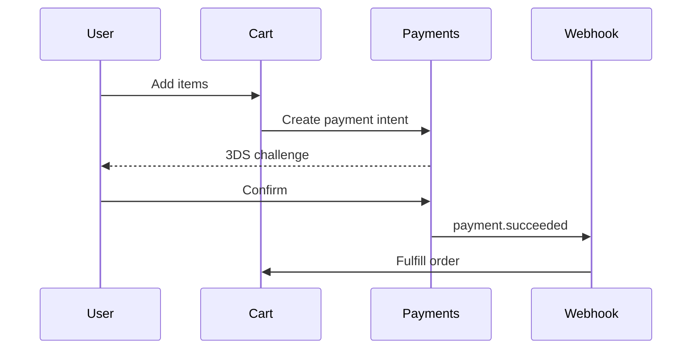

# Artifacts

Artifacts are standalone, self-contained pieces of content — a code file, a document, an HTML page, an SVG, a diagram, a React component, or a full interactive app — that Claude renders in a dedicated side panel next to the chat instead of inlining it in the conversation. They are designed to be edited, versioned, iterated on, and reused outside the chat: you can copy, download, publish to a link, embed, or remix them. The 2025–2026 evolution of Artifacts added **Claude-powered artifacts** (apps that call Claude's own API from inside the artifact), **persistent storage**, **MCP-connected live data**, and an enterprise **Claude Code Artifacts** surface that turns an agent session into a live, shareable dashboard.

## At a glance

| | |
|---|---|
| **What it is** | A separate, editable content canvas (the "Artifacts panel") that holds substantial or reusable output — code, docs, HTML, SVG, Mermaid diagrams, React components, and interactive AI apps. |
| **Where you find it** | Claude.ai web/desktop/mobile: opens automatically in a right-side panel when Claude produces qualifying content; a persistent **Artifacts** section in the left sidebar holds published ones. In Claude Code (Team/Enterprise beta): published to a private `claude.ai/code/artifact/...` URL. |
| **Who can use it (by plan)** | Core artifacts: Free, Pro, Max, Team, Enterprise (requires the **Code execution and file creation** capability enabled). MCP-in-artifacts and persistent storage: Pro, Max, Team, Enterprise. Claude Code Artifacts: Team and Enterprise only (beta). |
| **Status** | Generally available on claude.ai. **AI-powered artifacts** shipped 2025-07-25 (Free/Pro/Max) and 2025-07-31 (Team/Enterprise); **persistent storage** and **MCP connections** added in 2025 (Pro/Max/Team/Enterprise). **Claude Code Artifacts** is a Team/Enterprise **beta** (announced 2026-06). Cowork "**Live artifacts**" is a separate paid-plan desktop surface. |

---

## What an artifact is (and isn't)

Claude creates an artifact when content is **significant and self-contained** — per the docs, "typically over 15 lines" — and is something "you're likely to want to edit, iterate on, or reuse outside the conversation." Short answers, explanations woven into prose, and one-off snippets stay inline in chat; substantial deliverables get promoted to the panel.

An artifact is a discrete object with its own lifecycle: it has versions, can be edited independently of the chat turn that made it, and persists if you publish it. What it is **not** (especially in the Claude Code variant) is a deployed application — a single artifact is one self-contained page with no backend (with the notable exception of the in-app **Claude API** available to AI-powered artifacts on claude.ai).

```text
Chat message  →  "significant + self-contained" + likely-to-reuse  →  Artifact panel
Short reply / inline code / quick explanation                       →  stays in chat
```

---

## Supported artifact types

The documentation explicitly supports these types. Each is rendered live in the panel where applicable.

| Type | What it is | Example prompt |
|---|---|---|
| **Document** | Markdown or plain-text long-form content | "Write a 1,500-word onboarding guide as a document." |
| **Code snippet** | A single file in any language, syntax-highlighted, with a copy button | "Give me a Python script that dedupes a CSV by email column." |
| **HTML page** | A single-page website rendered live in the panel | "Build a one-page landing page for a coffee subscription." |
| **SVG image** | Scalable vector graphic, rendered visually | "Draw an SVG logo: a mountain inside a hexagon." |
| **Diagram / flowchart** | Mermaid (and similar) diagrams rendered to an image | "Diagram our auth flow as a Mermaid sequence diagram." |
| **Interactive React component** | A live, stateful React UI (calculators, widgets, mini-tools) | "Make a tip calculator with a bill input and a split slider." |
| **Interactive app / dashboard** | A full multi-component app, optionally AI-powered or data-connected | "Build a habit-tracker app with charts of my weekly streaks." |

> WARN: verify — the exact set of preloaded JS libraries inside React artifacts (commonly cited: React, Tailwind utility classes, `lucide-react`, `recharts`, `three.js`, `papaparse`, `mathjs`) is widely reported but is not enumerated in the official support article; confirm before relying on a specific library.

### Concrete examples

**1. A calculator app (React component)**

```text
You: Build a compound-interest calculator. Inputs for principal, annual rate,
years, and compounding frequency. Show the final balance and a year-by-year
table, with a line chart of growth.
```
Claude opens a React artifact with bound input fields, a computed table, and a chart — all interactive in the panel. You then say "add an inflation-adjusted column" and it edits in place, creating a new version.

**2. A data dashboard**

```text
You: Here's last quarter's sales CSV. Build a dashboard artifact with revenue
by region, top 10 products, and a month-over-month trend line.
```
Claude parses the data and renders an interactive dashboard (filters, charts, summary cards). On Pro/Max/Team/Enterprise you can wire it to **MCP connectors** so it pulls *live* figures instead of a static snapshot.

**3. A Mermaid diagram**

````text
You: Diagram our checkout pipeline.
````


**4. A landing page (HTML)**

```text
You: Make a single-page HTML landing page for "Pebble", a meditation app.
Hero, three feature cards, an email signup, and a footer. Use a calm palette.
```
The panel renders the page live; you iterate ("make the hero full-bleed", "add a pricing section") and each change is a new version. Then **Publish** to get a shareable link.

---

## How artifacts are created

**Automatic.** Claude promotes qualifying output to the panel on its own when it meets the significance/reuse bar.

**Explicit.** You can ask directly — "make this an artifact", "build me an app that…", "turn this into a document." You can also create artifacts from scratch or by customizing an existing one from the **Artifacts** section.

### Create from scratch (sidebar Artifacts section)

The dedicated **Artifacts** space in the left sidebar is the intended starting point for building a standalone artifact (rather than promoting chat output). Per the tutorials, **starting here signals your intent to Claude**, so it scopes the conversation toward building an app/tool/document. The space also lets you **browse curated artifacts** for inspiration, **customize existing creations**, **build from scratch through conversation**, and **organize** everything in one place.

1. Open **Artifacts** in the left sidebar of the Claude app.
2. **Describe the problem, not the spec.** Share the idea or pain point in plain language — e.g., "I wish I had a better way of teaching the water cycle to my class; they seem bored."
3. **Let Claude interview you.** It asks follow-up questions (audience, must-have features, constraints) to clarify the build.
4. **Ask Claude to build it.** Use a direct cue — "Can you create this for me?" or "Let's build this now." Claude generates the artifact from the conversation and opens it in the panel.
5. **Iterate in chat.** Request changes — "make the buttons bigger", "add a timer", "change the color scheme" — each one a new version. Debug in plain language ("the calculator breaks on decimals") or click **Try fixing with Claude** on errors.
6. **Publish when ready** (see below) to get a shareable link and add it to the sidebar.

You can also browse the curated gallery and click **Customize** on an existing artifact to start from a working template instead of a blank slate (your copy; the original is untouched).

**Create from scratch via chat.** You don't have to use the sidebar — in any conversation, an explicit request such as "Build me a standalone [tool/app/document] as an artifact" produces the same result; the sidebar entry point simply biases Claude toward an artifact-first build.

**Prerequisite — the capability toggle.** Artifacts require **Code execution and file creation** to be on:

- Free / Pro / Max: **Settings → Capabilities → Code execution and file creation** (toggle on).
- Team / Enterprise: **Organization settings → Capabilities → Code execution and file creation** (an admin enables it).

If artifacts never appear, this toggle is the first thing to check.

---

## Editing artifacts

You edit an artifact three ways, all without losing prior work:

1. **Ask Claude in chat.** "Change the button to teal", "add input validation", "make it mobile-responsive." Claude regenerates and bumps the version.
2. **Inline highlight edits (Markdown).** Highlight text in a Markdown artifact, click **Edit with Claude**, and type a targeted request — Claude rewrites just that span.
3. **Edit a prior chat message.** Editing the message that produced an artifact lets you explore an alternative branch without destroying the existing version.

For multi-file Markdown projects you can submit several edit requests in a batch.

### Version history & navigation

Every change creates a **version**. The panel includes a **version selector** so you can step backward and forward through iterations and compare them; you can revert to an earlier version by selecting it. When a chat has produced several artifacts, a **slider icon in the upper right** of the panel switches between them.

---

## Panel UI and actions

The artifact panel is a dedicated right-side window. Controls cluster in the lower-right corner of the panel:

| Action | What it does |
|---|---|
| **View code / Preview** | Toggle between the rendered output and its underlying source. |
| **Copy** | Copy the artifact content to the clipboard. |
| **Download** | Save the file locally (e.g., `.html`, `.md`, `.svg`, source file). |
| **Try fixing with Claude** | Appears on runtime/render errors; asks Claude to debug and repair. |
| **Version selector** | Move between versions of the same artifact. |
| **Publish** (Free/Pro/Max) | Create a public, shareable link and add the artifact to your sidebar. |
| **Share** (Team/Enterprise) | Share a version to authenticated members of your organization. |
| **Customize / Remix** | Open the artifact's content as the starting point of a *new* conversation — your copy, original untouched. |

### claude.ai panel: window controls (open / expand / navigate)

Beyond the lower-right action cluster above, the **claude.ai chat panel** itself has window-level affordances for opening, sizing, and moving between artifacts. (These are the chat-panel controls; the Claude Code variant's page controls are covered separately under [Claude Code Artifacts](#claude-code-artifacts-enterprise-live-dashboards).)

| Control | Action |
|---|---|
| **Open panel** | The panel opens automatically when Claude produces a qualifying artifact; click the artifact card inline in the chat to (re)open it in the right-side panel. |
| **Expand / full screen** | Expand the artifact to a full-screen view for a larger canvas (useful for interactive apps, dashboards, and running visuals) — then keep chatting alongside it. WARN: verify — official docs describe expanding visuals "to full screen" but do not name the exact button/icon; confirm the control label in-product. |
| **Version selector** | Step backward/forward through versions of the *same* artifact and revert by selecting an earlier one (see [Version history & navigation](#version-history--navigation)). |
| **Switch between artifacts** | When one chat produced several artifacts, the **slider icon in the upper right** of the panel switches among them. |
| **Close / collapse panel** | Collapse the panel back to the chat (e.g., via the panel's close control) to reclaim width; reopen by clicking the artifact card again. |
| **Open in new tab** | WARN: verify — *published* artifacts have their own `claude.ai` URL that opens in a browser tab, but a dedicated "open in new tab" affordance for an **unpublished** in-chat artifact is not documented in the official articles; treat as unconfirmed. |
| **Pin / star / favorite** | WARN: verify — published artifacts are collected in the sidebar **Artifacts** section and a browsable gallery, but an explicit pin/star/favorite control is not documented in the official support articles; treat as unconfirmed. |
| **Keyboard shortcut to toggle the panel** | WARN: verify — Claude.ai exposes a keyboard-shortcuts panel (profile → **Keyboard shortcuts**), and `Ctrl/Cmd + .` is widely reported to toggle the *left sidebar*, but no official source documents a dedicated shortcut to toggle the *Artifacts panel*; confirm in the in-app shortcuts list. |

> The confirmed, documented controls are **View code/Preview, Copy, Download, Try fixing with Claude, the version selector, the multi-artifact slider, Publish/Share, and Customize**. Full-screen expand is described in the docs but unnamed; open-in-new-tab (for unpublished), pin/star, and a panel-specific keyboard shortcut are **not** in the official articles and are flagged above.

---

## Publishing, sharing, embedding, and remixing

### Publish to a public link (Free, Pro, Max)

1. Open the artifact and confirm you're on the version you want.
2. Click **Publish**.
3. Copy the generated public link.

The artifact now lives in the **Artifacts** section of your sidebar. **Anyone with the link can view and interact with it without an account** (non-users are prompted to sign up for advanced/AI-powered features); signed-in Claude users get full customization and can save it.

### Embed on an external site

After publishing, a **Get embed code** button appears. It opens a modal with HTML embed code. You must list permitted hosts in the **Allowed domains** field (comma-separated URLs) for the embed to load.

### Unpublish (one-way)

An **Unpublish** button appears after publishing. Important caveat: once unpublished, **you cannot re-publish that same artifact** — you must create a new one. Unpublishing also **permanently deletes any persistent-storage data** attached to it.

### Remix / customize (all plans)

Clicking **Customize** starts a new conversation seeded with the artifact's content. Your edits never touch the original — this is also exactly what happens when *someone else* opens your shared AI-powered app: they get their own copy to develop independently.

### Share inside an organization (Team, Enterprise)

1. Open the artifact → **Share**.
2. Choose **Share & copy link**.

Only authenticated members of your organization (and, where applicable, members with project access) can open it. Team/Enterprise conversation artifacts **cannot be published publicly** — sharing is internal-only, distinct from the Free/Pro/Max public **Publish** flow.

> **Security note:** when you share a conversation artifact, viewers also gain access to **any attachments and files in the conversation that created it**. Don't share an artifact built in a chat that contains sensitive uploads.

---

## Claude-powered artifacts (AI apps inside an artifact)

This is the feature that turns an artifact into a working AI app: the artifact can call **Claude's own API from inside itself**, so the running page can answer questions, generate content, coach, play games, and adapt to user input — all without you wiring up infrastructure.

**The economics that make sharing viable:** whoever opens your shared app **authenticates with their own Claude account, and their API usage counts against their subscription, not yours.** You pay nothing for their usage, sharing is free at any scale, and **no API keys** change hands.

### How to build one

You don't write integration code — you *ask*: "add AI capabilities to this artifact", or describe the behavior:

```text
You: Build a simple chatbot artifact that uses Claude. Respond to every user
input with a genuine compliment about what they wrote.
```

Claude handles the prompt engineering, error handling, and orchestration, and produces a React artifact with a working chat box. You then iterate ("make it remember the conversation", "add a tone selector", "give it a dark theme").

### The in-artifact API

The artifact calls a completion function exposed on the page — `window.claude.complete` — with **no key and no endpoint config**. Confirmed signature (from Claude's own artifact tool instructions): it takes a **single string argument** (the prompt) and returns a **`Promise<string>`** (the completion text). There is no `messages` array, no system/role separation, no streaming, and no model selector — you compose the entire prompt as one string.

```javascript
// Inside an AI-powered artifact (React).
async function getCompliment(userText) {
  // Single string in, completion string out.
  const reply = await window.claude.complete(
    `You are a warm, specific complimenter. The user wrote: "${userText}".
     Respond with one genuine, specific compliment.`
  );
  return reply; // string
}
```

It is a deliberately **limited text-based completion** interface (send a prompt, get text back). To get structured output you instruct the prompt to return JSON and parse the string yourself:

```javascript
const raw = await window.claude.complete(
  `Extract the title and three tags from this note as JSON
   {"title": string, "tags": string[]}. Return ONLY the JSON. Note: ${note}`
);
const data = JSON.parse(raw); // you parse; the API has no structured-output mode
```

> Because the whole prompt is one string and the call returns a plain string, give the model exact output instructions (e.g., "return only JSON") and defensively handle parse failures and empty/partial replies in the UI.

### What's supported vs. not (inside AI-powered artifacts)

| Supported | Not supported |
|---|---|
| Calling Claude via the built-in completion API | Bringing your own API key / per-call billing |
| React UIs, file processing in the browser | External network calls / `fetch` to arbitrary hosts |
| Viewing and customizing the generated code | `localStorage` (browser storage) — use the **persistent storage** feature instead |
| Instant link sharing, viewer-pays-own-usage | Interleaved/complex multi-script setups |

**Plan availability:** AI-powered artifacts launched in beta for **Free, Pro, and Max** on **2025-07-25**, and were extended to **Team and Enterprise** on **2025-07-31**. When the prototype outgrows the artifact sandbox, the documented path is to copy the generated code into your editor / **Claude Code** and deploy on real infrastructure.

---

## Persistent storage and live (MCP-connected) data

Two features make artifacts "live" rather than static snapshots:

- **Persistent storage** (Pro, Max, Team, Enterprise; Claude web and desktop): a published artifact can keep data **across sessions**, with a **20 MB per-artifact** limit. Storage is **text-only — no images, files, or binary**, and can be configured as **personal** (each viewer keeps their own private data, e.g. a journal) or **shared** (all viewers see the same data, e.g. a game leaderboard). Two important gates: storage works **only for published artifacts** — during development/testing, storage operations fail until you publish — and **unpublishing deletes the stored data permanently** (both personal and shared).
- **MCP connections** (Pro, Max, Team, Enterprise; Claude web and desktop): an artifact can read from and write to external tools via the **Model Context Protocol** — e.g., Asana, Google Calendar, Slack, or any custom MCP server you've configured — so a dashboard refreshes with real data when you open it. See [../capabilities/mcp.md](../capabilities/mcp.md) and [../capabilities/connectors.md](../capabilities/connectors.md).

Together these underpin stateful, connected artifacts you return to repeatedly, that refresh on open instead of showing a frozen snapshot.

### Live artifacts in Claude Cowork (distinct surface)

"**Live artifacts**" is also the name of a specific feature in **[Claude Cowork](../platform/cowork.md)** (the desktop knowledge-work agent), available on **paid plans (Pro, Max, Team, Enterprise)** and only on the **Claude Desktop app for macOS and Windows**. A Cowork live artifact is a persistent, interactive HTML page (a tracker, dashboard, comparison tool, or reference) that:

- is saved to a dedicated **"Live artifacts"** tab in Cowork's sidebar, so you can **reopen, refresh, and iterate** on it from any future session — independent of the chat that created it;
- **refreshes with current data**, pulling from your **connected apps and local files** so the view reflects today, not the day it was built (cached for quick load, re-queries on its own, with a manual **refresh** button); and
- **keeps history** — each update saves a version you can restore.

This is a sibling of, not the same thing as, the conversation artifacts and Claude Code artifacts described above. For the full Cowork surface, see [../platform/cowork.md](../platform/cowork.md).

---

## Claude Code Artifacts (enterprise live dashboards)

Announced in 2026 (VentureBeat, 2026-06), **Claude Code Artifacts** turns an agent **session's** work into a live, interactive, shareable HTML page at a **private `claude.ai/code/artifact/...` URL** — built straight from the session's unbroken context (your local repo, connected monitoring tools, and conversational reasoning). Teammates with access watch the page **update in place in real time** as Claude works and as the underlying data and code change. Typical uses: a PR walkthrough with annotated diffs, a deploy-failure dashboard, side-by-side design options, or an investigation timeline that fills in during a long task.

### Create, update, share (from Claude Code)

```text
# Create — ask in plain language; Claude writes an .html/.md file and publishes it.
Make an artifact that walks through this PR with the diff annotated inline.

# Claude prompts: Claude wants to publish "..." to a private page on claude.ai → Yes
# It prints the URL and opens your browser. Press Ctrl+] to reopen the latest artifact.

# Update — republishes to the SAME url; each publish is a version.
Add a per-region breakdown below the summary chart and republish.

# Update from a different session — you MUST give the URL, else a new artifact is made.
Update https://claude.ai/code/artifact/5fbea6f3-... with today's numbers.
```

- **Share** from the page header to grant access to specific people or everyone in your org; the header names you as author and links your gallery at `claude.ai/code/artifacts`. Sharing **stops at your organization** — there is no public-link option (to send it outside, share the raw HTML file). Artifacts are **viewable, not co-edited**; you remain the only writer.
- **Auto-open:** set `CLAUDE_CODE_ARTIFACT_AUTO_OPEN=0` to stop the browser opening on publish.
- **Design system:** Claude applies a built-in design skill and will honor design tokens it finds in your repo (e.g., in `CLAUDE.md` or a theme file) — precedence is *your prompt > your design system > Claude's defaults*.

### Page constraints (Claude Code variant)

Each artifact is one self-contained page wrapped in an HTML shell under a **strict Content Security Policy (CSP)**:

| Constraint | Effect |
|---|---|
| **No external requests** | CSP blocks external scripts/styles/fonts/images and all `fetch`/XHR/WebSocket. CSS/JS are inlined; images embed as data URIs. |
| **No backend** | Static page — can't store form input, authenticate viewers, or call an API at view time. |
| **Single page** | Relative links don't resolve; multi-section content uses in-page anchors. |
| **File types** | Published file must be `.html`, `.htm`, or `.md` (Markdown renders as styled HTML). |
| **Rendered size** | Must be ≤ **16 MiB** (large embedded images are the usual cause of size failures). |

> Note the difference: **claude.ai AI-powered artifacts** *can* call Claude's API at view time; **Claude Code artifacts** are pure static captures with no view-time API and no backend.

### Availability & admin controls (Claude Code Artifacts)

All of these must hold, or Claude just writes a local HTML file instead:

| Requirement | Available when |
|---|---|
| Plan | **Team** (on by default) or **Enterprise** (Owner enables in claude.ai admin settings). |
| Auth | Signed in to claude.ai via `/login`. API keys, gateway tokens, and cloud-provider creds **cannot** publish. |
| Provider | **Anthropic API** only — not Amazon Bedrock, Google Vertex AI, or Microsoft Foundry. |
| Org policy | CMEK, HIPAA, and Zero Data Retention must **not** be enabled. |
| Surface | Claude Code CLI, or Claude desktop app ≥ 1.13576.0. Off by default in Agent SDK, GitHub Action, and MCP-server contexts, and when `CLAUDE_CODE_DISABLE_NONESSENTIAL_TRAFFIC` is set. |

**Disable for your own sessions:** `"disableArtifact": true` in settings, `CLAUDE_CODE_DISABLE_ARTIFACT=1`, or add `Artifact` to `permissions.deny`.

**Org admin:** **Settings → Claude Code → Capabilities → Artifacts** toggle (Enterprise can scope it per role under **Settings → Roles → Claude Code → Artifacts**). Retention is set under **Settings → Data & privacy controls** (separate periods for private vs. shared). Events land in the audit log as `claude_artifact_*`. The viewer loads from a sandboxed `*.claudeusercontent.com` origin — allowlist it alongside `claude.ai`. The **Compliance API** lists/retrieves/deletes artifacts (`GET/DELETE /v1/compliance/code/artifacts...`).

---

## Limits & what's not supported

- **Capability gate:** core artifacts need **Code execution and file creation** enabled.
- **Unpublishing is destructive and one-way:** you can't republish the same artifact, and persistent-storage data is deleted.
- **Persistent storage:** 20 MB/artifact, **text only**, published artifacts only.
- **AI-powered artifacts:** no bring-your-own API key, no arbitrary external `fetch`, no `localStorage`; text completions only.
- **Claude Code artifacts:** static single page, no backend, no external requests (CSP), ≤16 MiB, `.html`/`.htm`/`.md` only, org-internal sharing only, Anthropic-API-only, blocked under CMEK/HIPAA/ZDR.
- **Tokens:** generating a styled/interactive artifact consumes output tokens (more than the same content as plain text); large data-URI images are the biggest cost. Prefer SVG/HTML+CSS over raster images and summarize large datasets.

---

## Related pages

- [./projects.md](./projects.md) — Projects: knowledge base + instructions; artifacts created in a Project draw on its context.
- [./mcp.md](./mcp.md) — Model Context Protocol, which powers live-data artifacts.
- [./connectors.md](./connectors.md) — the connector catalog (Asana, Google Calendar, Slack, custom MCP) artifacts can read/write.
- [./skills.md](./skills.md) — reusable Agent Skills; turn a recurring artifact prompt into a command.
- [../platform/claude-ai.md](../platform/claude-ai.md) — the claude.ai app where the Artifacts panel and sidebar live.
- [../platform/claude-design.md](../platform/claude-design.md) — Claude Design's prompt-to-prototype visual workspace (sibling to interactive artifacts).
- [../platform/claude-code.md](../platform/claude-code.md) — Claude Code, home of the enterprise Artifacts beta.
- [../platform/cowork.md](../platform/cowork.md) — Claude Cowork, home of the "Live artifacts" tab (connected, auto-refreshing dashboards on desktop).
- [../glossary.md](../glossary.md) — term definitions.

## Open questions / to verify

- The exact preloaded JavaScript libraries inside React artifacts (React, Tailwind, `lucide-react`, `recharts`, `three.js`, `papaparse`, `mathjs`) — widely reported, not enumerated in the official support article.
- Whether `window.claude.complete` has gained (or will gain) a structured/messages-style or streaming variant. As of verification (2026-06-26) it remains a single-string-in, single-string-out text completion per Claude's artifact tool instructions; Anthropic's own blog still lists "No external API calls (yet)," so the surface may expand.
- Which Claude model backs `window.claude.complete`, and any rate/length limits on viewer-paid in-artifact calls.
- Whether persistent storage's 20 MB cap or the Claude Code 16 MiB render cap have changed since their 2025 introductions (both still current at verification).
- How Cowork "Live artifacts" relate to the older conversation persistent-storage/MCP "live" artifacts — likely a re-platforming, but not stated explicitly in the docs.
- **claude.ai panel "full screen" / expand control** — the docs describe expanding a visual "to full screen" but do not name the button/icon; confirm the exact label and where it sits in the panel.
- **Open-in-new-tab for *unpublished* in-chat artifacts** — published artifacts have their own URL, but a dedicated "open in new tab" affordance for a draft artifact is undocumented; confirm whether one exists.
- **Pin / star / favorite control** — published artifacts collect in the sidebar Artifacts section and gallery, but no explicit pin/star control is documented; confirm.
- **Keyboard shortcut to toggle the Artifacts panel** — `Ctrl/Cmd + .` is widely reported for the *left sidebar*, not the artifact panel; the in-app Keyboard shortcuts list is the authoritative source — confirm whether a panel-toggle shortcut exists.

## Sources

- [What are artifacts and how do I use them? — Claude Help Center](https://support.claude.com/en/articles/9487310-what-are-artifacts-and-how-do-i-use-them)
- [Publish and share artifacts — Claude Help Center](https://support.claude.com/en/articles/9547008-publish-and-share-artifacts)
- [Prototype AI-powered apps with Claude artifacts — claude.com tutorials](https://claude.com/resources/tutorials/prototype-ai-powered-apps-with-claude-artifacts)
- [Build and share AI-powered apps with Claude — claude.com blog](https://claude.com/blog/claude-powered-artifacts)
- [Share session output as artifacts — Claude Code Docs](https://code.claude.com/docs/en/artifacts)
- [Claude Code now supports artifacts — claude.com blog](https://claude.com/blog/artifacts-in-claude-code)
- [Use live artifacts in Claude Cowork — Claude Help Center](https://support.claude.com/en/articles/14729249-use-live-artifacts-in-claude-cowork)
- [Compliance API: code artifacts — Claude API Reference](https://docs.claude.com/en/api/compliance)
- [Anthropic's Claude Code Artifacts update brings live, shared dashboards… — VentureBeat (2026-06)](https://venturebeat.com/data/anthropics-claude-code-artifacts-update-brings-live-shared-dashboards-and-interactive-workspaces-to-enterprises)
